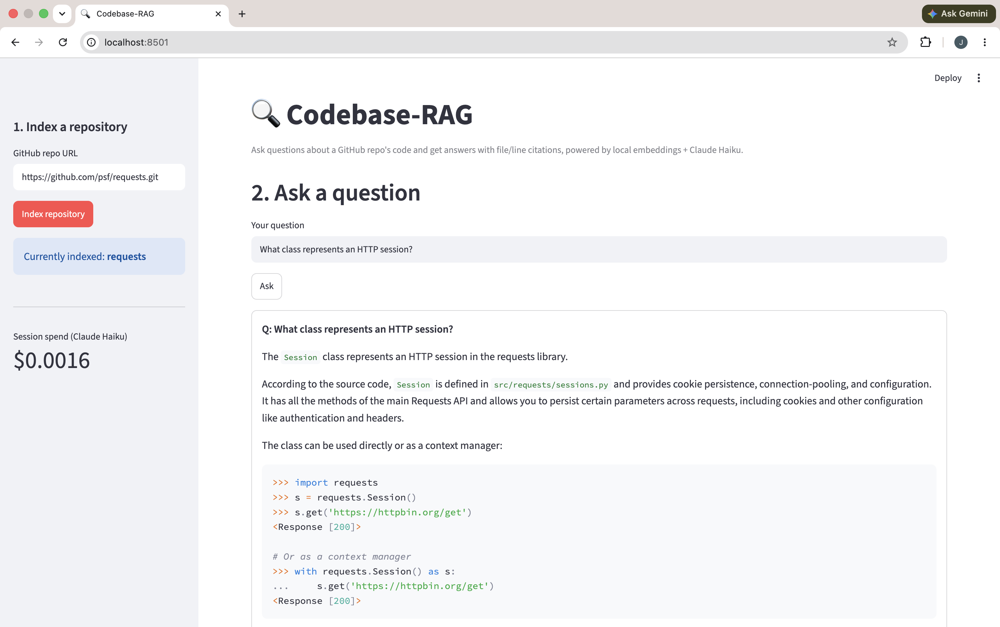
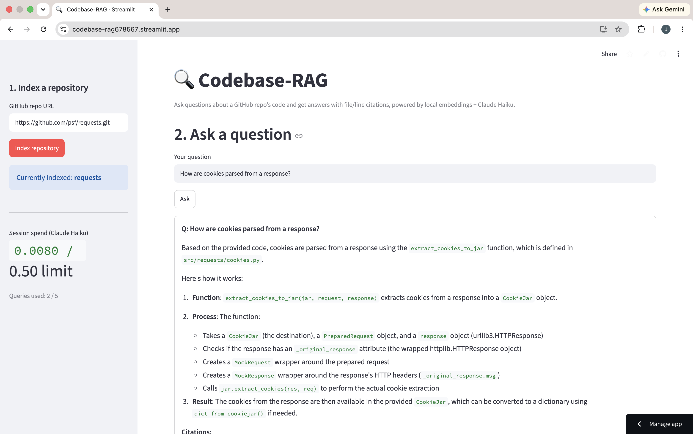

# Codebase-RAG

       

A RAG-based Q&A bot for GitHub repositories. Point it at a repo, ask questions
about the code, and get answers with file/line citations.

## Demo

[](https://codebase-rag678567.streamlit.app)

**[Live demo →](https://codebase-rag678567.streamlit.app)** — paste a repo URL, index it, and ask it questions yourself.

> The demo session has a hard cap ($0.50 / 5 queries) so a shared public link
> can't drain the project's API budget — see [Design decisions](#design-decisions--known-limitations).
> It also runs on an ephemeral container, so a fresh deploy means re-indexing.
> For unrestricted use, clone the repo and run it locally with your own
> `ANTHROPIC_API_KEY` (see [Setup](#setup)).



Indexed against [psf/requests](https://github.com/psf/requests) and asked
*"What class represents an HTTP session?"* — the answer correctly cites
`src/requests/sessions.py`, the actual source of the `Session` class, rather
than any of the documentation pages that also mention sessions.



The live deployment above, mid-session — sidebar shows the budget safeguard
tracking real spend and query count against the demo's caps.

## Stack

- **Chunking**: `ast`-based splitting for Python files (by function/class), line-based fallback for other file types
- **Embeddings**: local, via `sentence-transformers` (no API cost)
- **Vector store**: ChromaDB
- **Answer generation**: Claude Haiku (Anthropic API)
- **Backend**: FastAPI (`/index`, `/query`)
- **Frontend**: Streamlit

## Status

Early scaffolding — build log follows in commit history.

## Roadmap

- [x] Repo init + .gitignore + requirements.txt + README stub
- [x] Script to clone/walk a target repo and chunk files (ast-based for .py, line-based fallback for others)
- [x] Local embedding generation with sentence-transformers + store in ChromaDB with file/line metadata
- [x] RAG prompt construction + Claude Haiku API call for answer generation, with file/line citations
- [x] Wrap into FastAPI endpoints: /index and /query
- [x] Streamlit frontend: paste repo URL, index, ask questions, see cited answers
- [x] Basic tests (chunking logic + retrieval sanity checks, mocked LLM call) + GitHub Actions CI workflow
- [ ] Polish README with architecture explanation and setup instructions

## Design decisions & known limitations

**Retrieval sometimes ranks docs above the code that actually implements a feature.**
Manual retrieval checks (step 3, against `psf/requests`) showed that changelog/doc
files (`HISTORY.md`, `docs/*.rst`) can outrank the actual source code for a query,
because prose often repeats the query's keywords more literally than code does —
e.g. a query about "HTTP redirects" ranked `HISTORY.md` entries above the
`SessionRedirectMixin` class that implements the behavior.

Rather than fix this at the retrieval layer (e.g. reranking, hybrid search), the
**answer-generation prompt (step 4) is told explicitly to prioritize source code
over non-code chunks** (README/HISTORY/CHANGELOG/docs) when both are retrieved,
and to say so — rather than guess — when no relevant source code was retrieved at
all. This was verified with two test queries against Claude Haiku:

- A query where no code chunk was retrieved in the top 5: the model correctly
  said the implementing class wasn't present in its context, instead of
  fabricating an answer from the docs.
- A query where a doc chunk outranked a code chunk: the model cited only the
  actual source function (`extract_cookies_to_jar` in `cookies.py`) and ignored
  the higher-ranked doc chunk.

**Public demo capped at $0.50 / 5 queries per session to protect API budget** —
clone and run locally with your own key for unrestricted use. The cap lives in
`streamlit_app.py` (`SESSION_BUDGET_LIMIT`, `MAX_QUERIES_PER_SESSION`), tracked
per browser session via `st.session_state` so it resets only on a new session,
not on every rerun.

## Setup

```bash
python -m venv .venv
source .venv/bin/activate
pip install -r requirements.txt
```

You'll need an `ANTHROPIC_API_KEY` set in your environment (or a `.env` file)
to use answer generation.

More setup and architecture details to come as the project is built out.
